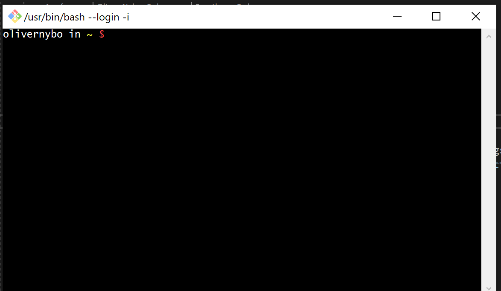

# git-bash-setup

## Installation
Git Bash skulle gerne være installeret på forhånd fra vi installerede Git. Hvis ikke så kør [Git installer'en](https://git-scm.com/downloads).

Når du åbner Git Bash skulle du gerne se noget lignende dette  


## Customization
Personlig er jeg ikke fan af den *prompt*, så lad os customize den lidt.

Vi starter med at åbne Git Bash og skrive
```
$ cd ~
```
Dette vil sikre os vi er i vores *home directory*

Derefter vil vi oprette en ny fil kaldet **.bash_profile**
```
$ touch .bash_profile
```
`touch` opretter en tom fil i det *directory* du er i.  
Disse kommandoer er også beskrevet i **#terminal-commands** på Discord.

Derefter åbner vi filen med **VIM**
> *IKKE* ***NANO*** `vim > nano`
```
$ vim .bash_profile
```

For at gå i *insert mode* tryk på `i`.

Indsæt så følgende (højre klik *paste*)
```bash
# Her sætter vi vores farver, dette er bare lokale variabler
username_color=$(tput setaf 7);
directory_color=$(tput setaf 3);
general_text_color=$(tput setaf 7);
start_color=$(tput setaf 1);
branch_color=$start_color; # Samme farve som start_color - $(tput setaf 1)
bold=$(tput bold);
reset=$(tput sgr0);

# Her ændre vi vores prompt
PS1="\[${bold}\]";
PS1+="\[${username_color}\]\u";
PS1+="\[${general_text_color}\] in ";
PS1+="\[${directory_color}\]\W ";
PS1+="\[${branch_color}\]\$(__git_ps1 '(%s) ')"
PS1+="\[${start_color}\]\$ \[${reset}\]";

export PS1 # Når vi er færdige eksportere vi variablet
```

Tryk så på `ESC` for at gå ud af *insert mode*.  
Skriv så `:wq` for at gemme filen og lukke den.

Efter en genstart af Git Bash skulle jeres terminal gerne ligne denne

> Selvfølgelig med et andet *username*