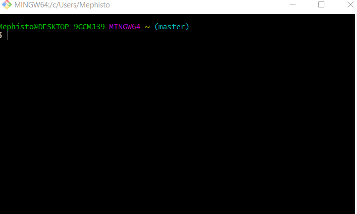
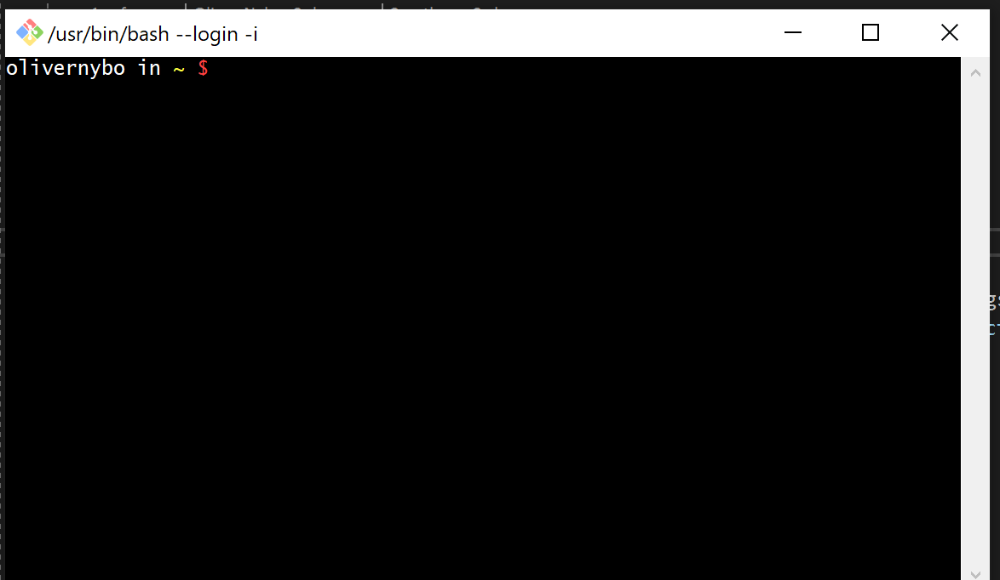
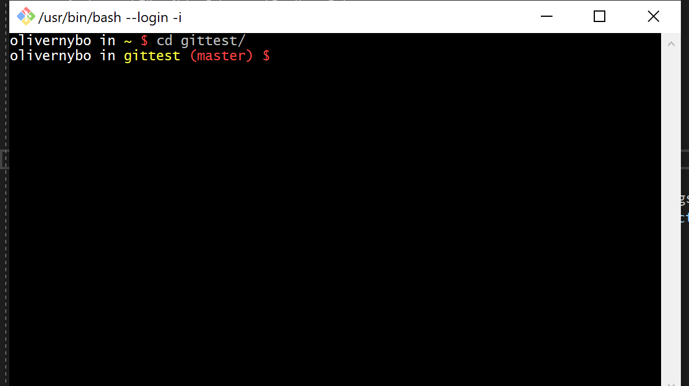
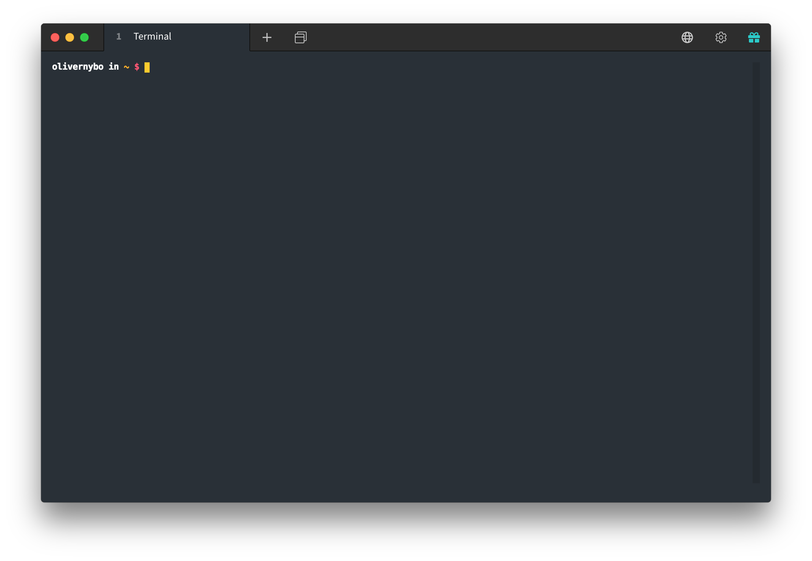

# git-bash-setup

## Hvorfor Git Bash?
Git Bash er *bare* en alternativ kommandoprompt, men den har den specielle egenskab at konvertere **UNIX** kommandoer om til noget **Windows** operativsystemet kan forstå.

En god grund til at bruge Git Bash som ens *daily driver* er for at få disse **UNIX** kommandoer ind under huden, for i praksis køre 99% af alle virksomheders *servere* en form for **Linux** (et **UNIX** baseret operativsystem). Ved at bruge Git Bash undgår man derved også dumme fejl, hvor man for eksempel kommer til at skrive en **Windows** kommando på ens *server* eller vise versa.

## Installation
Git Bash skulle gerne være installeret på forhånd fra vi installerede Git. Hvis ikke så kør [Git installer'en](https://git-scm.com/downloads).

## Customization
Når du åbner Git Bash skulle du gerne se noget lignende dette


Personlig er jeg ikke fan af den *prompt*, så lad os customize den lidt.

Vi starter med at åbne Git Bash og skrive
```
$ cd ~
```
Dette vil sikre os vi er i vores *home directory*

Derefter vil vi oprette en ny fil kaldet **.bash_profile**
```
$ touch .bash_profile
```
`touch` opretter en tom fil i det *directory* du er i.  
Disse kommandoer er også beskrevet i **#terminal-commands** på Discord.

Derefter åbner vi filen med **VIM**
> *IKKE* ***NANO*** *cuz VIM better*
```
$ vim .bash_profile
```

For at gå i *insert mode* tryk på `i`.

Indsæt så følgende (højre klik *paste*)
```bash
# Her sætter vi vores farver, dette er bare lokale variabler
general_text_color=$(tput setaf 7);
username_color=$general_text_color; # Samme farve som general_text_color - $(tput setaf 7)
directory_color=$(tput setaf 3);
start_color=$(tput setaf 1);
branch_color=$start_color; # Samme farve som start_color - $(tput setaf 1)
bold=$(tput bold);
reset=$(tput sgr0);

# Her ændre vi vores prompt
PS1="\[${bold}\]";
PS1+="\[${username_color}\]\u";
PS1+="\[${general_text_color}\] in ";
PS1+="\[${directory_color}\]\W ";
PS1+="\[${branch_color}\]\$(__git_ps1 '(%s) ')"
PS1+="\[${start_color}\]\$ \[${reset}\]";

export PS1 # Når vi er færdige eksportere vi variablet
```

Tryk så på `ESC` for at gå ud af *insert mode*.  
Skriv så `:wq` for at gemme filen og lukke den.

Efter en genstart af Git Bash skulle jeres terminal gerne ligne denne

> Selvfølgelig med et andet *username*

Hvis du ikke er tilfreds med farverne, kan de ændres ved at redigere de forskellige `tput setaf` *statements*. *Color tables* er nemme at finde på Google og Stack Overflow.

Hvis du prøver at `cd` ind i et *Git repository* er det også muligt at se hvilken *branch* man er på.


## Terminus
Det er også muligt at installere endnu en *third party* terminal og udskifte deres *shell* med Git Bash.

Jeg brugser selv en der hedder Terminus. Den har mange *customization options* samt en **Login Manager** til *servere*.

Det eneste *drawback* med Terminus er, at den er bygget på **Electron**, som er bygget på **Chromium**. Hvis du ikke har mange *system resources* eller ikke stoler på Google, er det nok ikke den rette terminal for dig, ellers fortsæt.

Start med at downloade deres nyeste release fra [deres GitHub](https://github.com/Eugeny/terminus/releases/tag/latest).

Efter at Terminus er installeret, gå til **Settings** og vælg **Shell**. I **Profile** vælg Git Bash.

Efter en genstart af Terminus skulle det gerne se sådan ud
